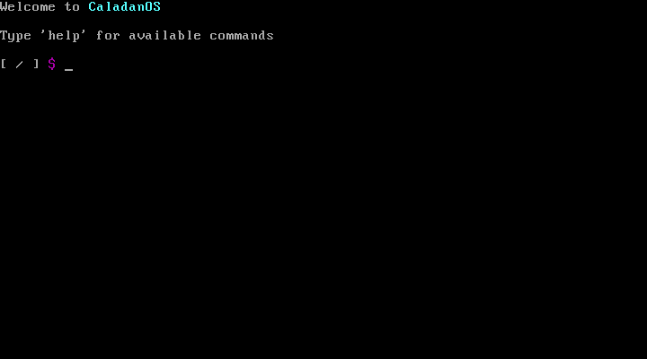

# CaladanOS

## Description
CaladanOS is simple os written in C;

Currently supporting:
  simple memory management (map, kmalloc...);
  runtime ramfs from cpio archive;
  simple shell (part of kernel) to interact with ramfs;

## How to Run
### Downlaod git repository
  ```bash
  git clone https://github.com/Gabko890/CaladanOS.git
  ```
### Compilation
  ```bash
  cd CaladanOS
  make
  ```
### Run
  If you have qemu installed (on linux), after compiling just run:
  ```bash
  make qemu
  ```
  Or you can use any Virtual machine (BIOS boot),
  ISO is available in build/CaladnOS.iso

## Screenshots

