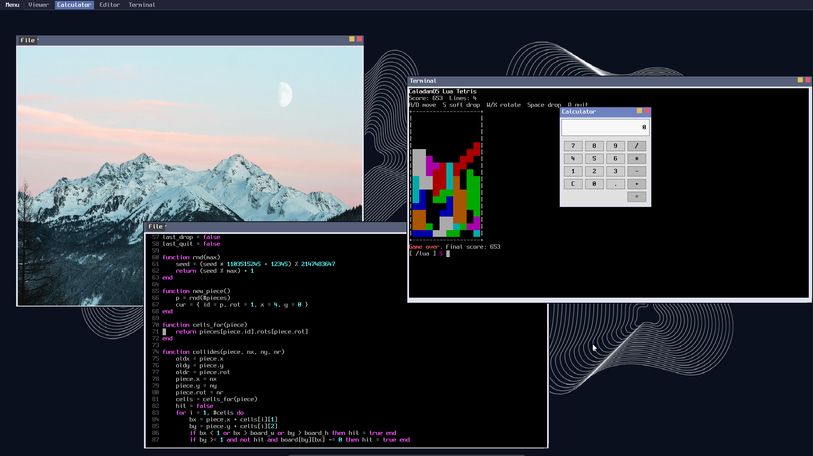

# CaladanOS

## Description
CaladanOS is a simple experimental operating system written in C, developed as a school maturity project.  
The project focuses on understanding low-level system design, custom runtime environments, and building a minimal graphical user interface from scratch.

## Features

### Core System
- Basic memory management (paging, memory mapping)
- Runtime RAM filesystem (RAMFS) loaded from a CPIO archive
- Kernel-integrated shell

### Terminal Environment
- TTY-like terminal interface
- Reimplementation of selected GNU core utilities (integrated into kernel)

### Runtime & Extensibility
- Embedded Lua virtual machine for scripting and extensibility

### Graphical Environment
- Custom desktop environment
- Built-in applications:
  - Terminal
  - Text editor
  - Image viewer
  - Calculator
  - Snake game

## Getting Started

### Clone Repository
    git clone https://github.com/Gabko890/CaladanOS.git

### Build (Docker required)
    cd CaladanOS
    make

### Run
If you have QEMU installed:
    make qemu

Alternatively, you can use any virtual machine supporting BIOS boot.

## Prebuilt ISO
A prebuilt ISO image is available in the **Releases** section.

If building locally, the ISO will be generated at:
    build/CaladanOS.iso

## Notes
- The system is single-threaded and intended for educational and demonstration purposes
- RAMFS is rebuilt on each boot, ensuring a clean state
- The project focuses on understanding OS internals rather than production use
