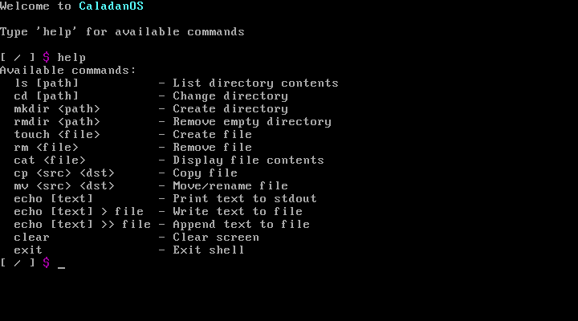

# CaladanOS

## Description
CaladanOS is simple os writen in C99

## How to Run
### Downlaod git repository
  ```bash
  git clone https://github.com/Gabko890/CaladanOS.git
  ```
### Compilation
  ```bash
  cd CaladanOS
  make
  ```
### Run
  If you have qemu installed (linux), after compiling just run:
  ```bash
  make qemu
  ```
  Or using different Virtual machine (eg. VirtualBox), ISO is placed in build/CaladnOS.iso

## Screenshots

